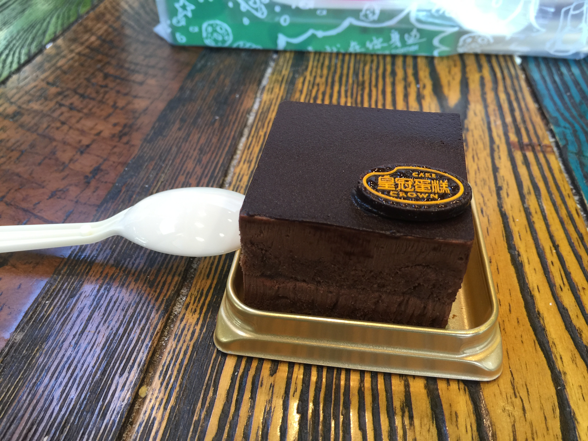

# 生日这天
*12/27*

对啊，昨天我生日诶。

怎么说呢，每年到生日这天，心里会变得有点奇特，特别希望今天能过的十分顺心。昨天我确实过的特别顺心。

虽然早上要很早起来（七点其实不算早了吧，和高中比起来，不过自从退了广播站我好像从来还没有在七点之前起过床）去玩研讨课，不过一切顺利，到了食堂也吃到了皮蛋瘦肉粥、豆沙包。之后乘车去西面，好在来得巧，坐到了一个座位，舒舒服服地看风景看到了西面。

研讨课也很有意思，教授没有来，研究生带我们走了一遍到时展示的流程，我们的演示文稿（我讨厌叫它PPT，因为太微软了）照例是做的最好的，好在我之前特别提醒不要用稀奇古怪的娃娃体、楷书、隶书、行书……生日这天能够离丑的不行的字体远一点的感觉很棒。

之后和Neutrino（啊他的名字我不知道拼对了没有）说好中午一起去吃麦当劳，我看着难得来一次西面想练会钢琴，于是和他分头行动了。哈农总算练熟了前十首了。走出来已经十一点多了。于是乘车到麦当劳。

Σ( ° △ °|||)︴在麦当劳居然看到了托福班的同学，可是怎么也想不起来他名字了，但是我知道肯定是他……因为，他从来不离某女生半步，每次看到他他都是和女朋友在一起。忽略这段做电灯泡的（反正有Neutrino一起做蛤蛤蛤）半小时。中午吃到了最喜欢吃的双层培根蔬荟堡，爽极了。然而没拍照。

吃完了，去买蛋糕了。可惜到了蛋糕店，说蛋糕要至少提前三天预订Σ( ° △ °|||)︴。没办法只好买了小蛋糕。坐在蛋糕店里，外面的太阳照过来，每一粒蛋糕屑都看的清清楚楚。生活真是太美好了。

吃完蛋糕，阳光正好，就不坐车了。路上看到了这个。

下午回去晒被子了=_=。

晚上又出去了，带着数学作业去咖啡馆吃面（奇怪的搭配），坐在左边一桌的有两女一男，两个中国女生陪着一个像是中东的男生喝咖啡，其中一个女生看的出来经常和外国友人交流嘛，接了个电话，对话是这样的：

> Just tell me where you are!

> OK, fine. Tell me your problem!

> The dish you want is not *selled* any more!

标准英语啊蛤蛤蛤。

那个外国友人多次问我借书，看到我桌上有微积分的书，就拿过去问那两个女生这是什么书。很有意思。之后他们走了。

后来看到裸羊在群里发了个视频，是纯黑玩I wanna be the guy，正好咖啡馆有wifi，看得我狂笑不止。

九点半了，我回去了。

回到房间，妈妈发消息来了。

> 谢谢你，儿子！你的健康成长是我们最大的快乐！

我一直觉得爸妈这一辈人的聊天手法很神奇，只要观察家长群，就会发现到处都是“呵呵”还有QQ独有的已经被我们玩坏的“微笑”表情。

但是用了同样的聊天手法的这一句，我看的好感动。