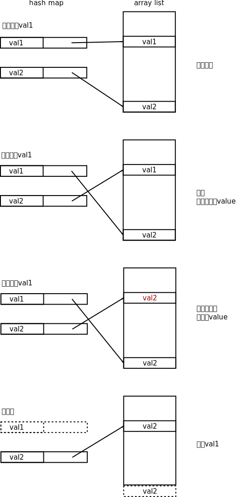

==========
Amazon题库
==========

.. default-role:: math

.. contents::

今天开始一道一道刷Amazon的面试题吧！题目列表是从 `这里 <https://1o24bbs.com/t/topic/12368>`_ 找的，不知道准不准。

二叉树的最大深度
==============

`Leetcode 104 <https://leetcode.com/problems/maximum-depth-of-binary-tree/>`_

    给一个二叉树，这个二叉树有几层？

这也太简单了，按层遍历一波带走

.. literalinclude:: 104.py
    :language: python

二叉树是否是另一棵二叉树的子树
==========================

`Leetcode 572 <https://leetcode.com/problems/subtree-of-another-tree/>`_

    给两个二叉树 ``s, t`` ， ``t`` 是否是 ``s`` 的子树？

遍历 ``s`` 的每个子树，看有没有哪个子树和 ``t`` 相等就好了。

首先要写一个helper function，判断两个二叉树是否是相等。很简单，用递归写就好了

.. literalinclude:: 572.py
    :language: python

一组一组地颠倒链表
======================

`Leetcode 25 <https://leetcode.com/problems/reverse-nodes-in-k-group/>`_

    给一个链表，每次数 `k` 个元素，颠倒一下。如果到最后不满 `k` 个，就不动。

比如

::

    1, 2, 3, 4, 5

-   如果 `k = 2` ，那么结果是 ``2, 1, 4, 3, 5``
-   如果 `k = 3` ，那么结果是 ``3, 2, 1, 4, 5``

如果我自己写，很简单，我肯定先把链表转换成List，然后做颠倒，然后再转换回来。但是这道题要求常数空间，所以就不能这么做了。

.. literalinclude:: 25.py
    :language: python

不使用内建函数实现 `x^n`
======================

`Leetcode 50 <https://leetcode.com/problems/powx-n/>`_

注意 `n` 可能是是负数哦。

分情况讨论吧

-   如果 `x = 0`

    -   并且 `n = 0` ，那么未定义
    -   否则就是0

-   如果 `x \neq 0`

    -   如果 `n = 0` ，那么是1
    -   如果 `n < 0` ，那么是 `{1 \over x^{-n}}`
    -   如果 `n > 0` 并且是个偶数，那么做一下转换

        .. math::

            x^n = x^{2 \cdot {n \over 2}} = (x^2)^{n \over 2}

    -   如果 `n > 0` 并且是个奇数，那么 `n - 1` 就是偶数了啊

        .. math::

            x^n = x^{1 + (n - 1)} = x \cdot x^{n - 1}

注意Python虽然int不会overflow，但是float会overflow……这点真的好奇怪。

而且 ``x ** 2`` 和 ``x * x`` 效果还不一样啊！ ``x ** 2`` 可能会overflow但是 ``x * x`` 就不会overflow。

.. literalinclude:: 50.py
    :language: python

垂直遍历二叉树
============

这道是人民币玩家才能做的……

-----

我还是先把最高频的50道做完吧_(:з」∠)_

2 sum
=====

`Leetcode 1 <https://leetcode.com/problems/two-sum/>`_

这个说烂了。

竖式加法
=======

`Leetcode 2 <https://leetcode.com/problems/add-two-numbers/>`_

.. literalinclude:: 2.py
    :language: python

实现LRU缓存
==========

`Leetcode 146 <https://leetcode.com/problems/lru-cache/>`_

用linked list和hash map实现。

根本矛盾是

-   linked list可以保存顺序信息，但是没法做到 `O(1)` 访问任意一个节点
-   hash map可以做到 `O(1)` 访问，但是没法保存顺序信息

所以这两个是互补的，同时用它们，就可以做到既能保存顺序信息、又能 `O(1)` 访问。怎么做呢？

-   hash map的key存key，value不存value，存linked list里的节点的引用
-   linked list里的节点既存key又存value

为什么要这么麻烦？你仔细想一下每个流程

-   `O(1)` 判断key是否存在

    可以用hash map做到

-   `O(1)` 返回一个key对应的value

    这个也可以用hash map做到

-   如果缓存满了，又要加入新的key，需要 `O(1)` 删除最远使用的key

    这个绝对没问题，这样安排linked list：越靠左边的节点，代表越最近访问的key。linked list可以做到 `O(1)` 删除最后一个节点。

    删除linked list里最后一个节点的时候，hash map里的条目也要跟着删除，可是linked list里面的节点里只存value，不知道对应的是hash map里的哪一个条目啊。

    那就让linked list里面的节点不光要存value，也要存key就好了。

-   如果是访问一个缓存中已经存在的key，需要 `O(1)` 把那个key移动到最近

    这个就有点难了，linked list并不能做到 `O(1)` 其中任意一个节点。

    那怎么办？hash map可以做到啊，让hash map的不存value、而是存节点的引用不就好了？

再次总结一下重点

-   需要hash map和double linked list这是肯定的，我能想到
-   hash map的value存的是节点的引用，而不是value
-   linked list里面的节点存的是key和value

.. literalinclude:: 146.py
    :language: python

最长回文substring
================

`Leetcode <https://leetcode.com/problems/longest-palindromic-substring/>`_

.. literalinclude:: 5.py
    :language: python

岛屿的数量
=========

`Leetcode <https://leetcode.com/problems/number-of-islands/>`_

Union find基础题，不多说了。

.. literalinclude:: 200.py
    :language: python

实现LFU缓存
===========

`Leetcode <https://leetcode.com/problems/lfu-cache/>`_

.. literalinclude:: 460.py
    :language: python

关键通路
=======

`Leetcode <https://leetcode.com/problems/critical-connections-in-a-network/>`_

哇，这题很有意思的

    给一个无向无权图 `G = (V, E)` ，含有 `n` 个节点，起点是0号节点，终点是 `n - 1` 号节点。图中哪些边满足，仅仅就删掉这一条边之后，就没有办法从起点走到终点了呢？

.. literalinclude:: 1192.py
    :language: python

验证括号嵌套
==========

`Leetcode 20 <https://leetcode.com/problems/valid-parentheses/>`_

简单的，用stack

.. literalinclude:: 20.py
    :language: python

合并两个排好序的链表
=================

`Leetcode 21 <https://leetcode.com/problems/merge-two-sorted-lists/>`_

想象一下在你面前有两列从小到大排列好的扑克牌，你会怎么把它们合并成一个扑克牌呢？肯定是分别比较两列扑克牌的最前面、最小的那张，看哪个牌堆的第一张扑克牌小，取出来。如果某列扑克牌取完了，就直接把剩下的那一堆移动过来就好了。

这样写其实我不喜欢，我觉得改变了原来的链表，最好应该能生成一个新的。

.. literalinclude:: 21.py
    :language: python

合并多个排好序的链表
=================

`Leetcode 23 <https://leetcode.com/problems/merge-k-sorted-lists/>`_

我好怀疑这个题是不是上一题的follow-up，频率都离得这么近。

Merge sort里会用到这个函数。

做法是不停地两个两个合并（可以直接利用上一题的函数），直到最后只有一个linked list为止。

.. literalinclude:: 23.py
    :language: python

排序两种日志字符串
===============

`Leetcode 937 <https://leetcode.com/problems/reorder-data-in-log-files/>`_

这个毫无难度。按照它说的做就好了。先把letter log和digit log分成两堆，然后用自定义key排序digit log，注意它说的

-   先按identifier后面的排序
-   如果出现重复的，再按identifier后面的日志内容排序

.. literalinclude:: 937.py
    :language: python

链表深复制
=========

`Leetcode <https://leetcode.com/problems/copy-list-with-random-pointer/>`_

我的做法很简单，搞一个hash map，key是老节点，value是新节点。第一遍遍历把所有新节点对象都造好，第二遍遍历的时候利用hash map解决引用问题。

.. literalinclude:: 138.py
    :language: python

整数的英文说法
============

`Leetcode 273 <https://leetcode.com/problems/integer-to-english-words/>`_

.. literalinclude:: 273.py
    :language: python

序列化和反序列化二叉树
===================

最少需要多少间会议室
=================

`Leetcode <https://leetcode.com/problems/meeting-rooms-ii/>`_

    给一些左闭右开的区间，代表会议的时间区间，至少需要多少间会议室？

这个题目的 `简单版本 <https://leetcode.com/problems/meeting-rooms>`_ 是

    给一些左闭右开区间，代表时间区间，这些时间区间是否两两之间都互相兼容、没有时间冲突？

.. literalinclude:: 253.py
    :language: python

离原点最近的 `k` 个点
==================

`Leetcode 973 <https://leetcode.com/problems/k-closest-points-to-origin/>`_

太简单了吧……这种题怎么会高频考。

.. literalinclude:: 973.py
    :language: python

.. literalinclude:: 973.rs
    :language: rust

乱序字符分组
===========

`Leetcode 49 <https://leetcode.com/problems/group-anagrams/>`_

    给一堆字符串，把anagram相同的都归到一组。

如果两个字符串互为anagram，那么给它们按字典序排序之后得到相同的字符串。

.. literalinclude:: 49.py
    :language: python

设计插入、删除、随机选取都是 `O(1)` 的数据结构
========================================

`Leetcode 380 <https://leetcode.com/problems/insert-delete-getrandom-o1/>`_

这个真的太牛逼了，我看了答案觉得啧啧称奇，自己估计永远都没法想出来。

首先是插入和删除都要 `O(1)` 这个需求，很容易想到用hash set或者hash map。但是随机选取要 `O(1)` 这个需求用hash set和hash map是没法做到的，因为hash系列（hash set和hash map）都是无序的，而随机选取的本质是生成一个随机地址，然后选择那个随机地址上的内容。

有人说，那没问题啊，我先把hash map里所有的key都放在array list里面，再随机好不好啊？那这样把hash map转换成array list的复杂度就是 `O(n)` 了。不满足要求了。

所以这里需要用一下hash map和array list的结合，同时又要避免转换的过程。我想到了LRU那道题里面的做法。回忆一下LRU那道题，hash map里面存的是linked list里的node，node里面存的是key、value。

那么这里是不是也可以这样搞呢？可以啊，让hash map的key存题目里那个 ``val`` ，value存array list里key所在的下标，然后array list里再存key。想想这样是不是可以做到随机选取是 `O(1)` ？可以的，给随机数之后， `O(1)` 时间内能定位到array list的某一个元素，而这个元素正好是某个 ``val`` ，那不就是 `O(1)` 了吗？

插入的时候可以做到 `O(1)` 吗？可以的，直接在hash map里建一个新的条目，再在array list的最后追加一个元素 ``val`` ，让新条目的value指向这个元素（也就是存这个元素的下标）就好了。

但是问题是删除没法做到 `O(1)` 。我一开始的想法是，删除某个 ``val`` 的时候，只需要删掉hash map里对应的条目，array list里面的东西不管，随机选取的时候，如果抽中某个hash map不存在的 ``val`` 就再抽一次……这样有一个问题就是如果hash map里元素基本上都删掉了，随机选取就会很慢，因为总是抽到hash map里面没有的东西。

怎么解决这个问题呢？精妙的部分来了。删除的时候，array list里面的元素也是要跟着删除的，然而这里有一个矛盾，删除array list里的某个元素的复杂度是 `O(n)` ，因为假如你删的是最后一个元素，没问题，删掉就好了；假如不巧你删掉的是第一个元素，那么后面所有的元素都要往前顺位。

那我用linked list好不好？linked list虽然避免了删除 `O(n)` 的缺点，但是linked list没有随机访问的性质啊，访问linked list的第一个元素和最后一个元素的复杂度是不一样的，那么这样的话随机选取 `O(1)` 那个需求就没法满足了。

怎么办？刚才其实暗示过了，删除array list的最后一个元素是最快的，那我不如把我要删的那个元素和array list的最后一个元素调换一下位置。啥意思呢？假设我要删除的条目是 ``(key1, value1)`` ，array list的最后一个元素存的是 ``key2`` ，那么很简单，我调换一下 ``value1, value2`` ，两个条目变成

::

    (key1, value2) -> value2 指向array list的最后一个元素
    (key2, value1)

再让 ``array[value1] = value1, array[value2] = value2`` ，然后删掉hash map中的 ``(key1, value2)`` 和array list中的最后一个元素，是不是就好了？

简单画了一个图

.. literalinclude:: 380.py
    :language: python

二叉树中最大路径和
===============

`Leetcode 124 <https://leetcode.com/problems/binary-tree-maximum-path-sum/>`_

.. literalinclude:: 124.py
    :language: python

嵌套列表降维
===========

`Leetcode 341 <https://leetcode.com/problems/flatten-nested-list-iterator/>`_

就是把类似 ``[1, 2, [1, 2, [3]], [2, 3]]`` 这种东西展平成 ``[1, 2, 1, 2, 3, 2, 3]`` 。

我自己做的话肯定是一下子就把整个列表弄出来存在那里，然后需要的时候一个一个吐出来。

但是面试的时候可能会叫你用online的方法，因为这样省内存。

想了很久，中间试过递归之类的办法，但是好像都不省内存。最后看了答案，发现超级简单。

用一个queue，每次 ``hasNext()`` 的时候，保证最前面的元素是integer就可以了。如果发现最前面的元素不是integer，就不停地展开，直到最前面的元素是integer为止。这样在 ``next()`` 的时候，只需要把第一个元素pop出来就好了。

.. literalinclude:: 341.py
    :language: python