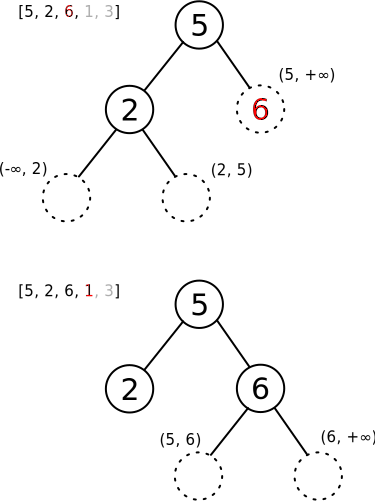

=============
MathWorks题库
=============

.. default-role:: math

.. contents::
    :backlinks: none

收到了MathWorks的面试呀！赶紧来抱个佛脚。

Huffman树
=========

`Leetcode 1130 <https://leetcode.com/problems/minimum-cost-tree-from-leaf-values/>`_

用构建Huffman树的做法做，本质上是greedy，复杂度是 `O(n^2)` 。

.. literalinclude:: 1130.py
    :language: python

验证数组是否是二分搜索树的先根遍历
=============================

`Leetcode 255 <https://leetcode.com/problems/verify-preorder-sequence-in-binary-search-tree/>`_

这道题好难，我一开始没想出来。我只知道二分搜索树的中根遍历能得到一个从小到大排好序的数组，但是不知道前根遍历有什么性质。

然后就想先重建树、然后再取树的先根遍历，再利用先根遍历的性质来验证。但是一时间没有想到怎样在 `O(n)` 内重建树。

后来想了两天，终于想到了一个绝妙的方法！翻了一圈discussion都没有发现我这个方法。

这个方法的本质还是重建树，但是是尽最大努力来重建树，一旦发现接下来没办法继续重建，就说明数组不是BST的先根遍历。听我慢慢讲。

最关键的事情是，在重建过程中，遇到某个数字需要插入到BST里的时候，需要满足两方面条件

-   不能违背preorder的性质
-   不能违背BST的性质

也就是说，要想把接下来一个数字插入到BST里、形成更大的一颗BST之前，这个数字不是随便什么地方都能插入的，要满足插入之后，树的preorder仍然是原数组，同时树仍然是BST。所以如果发现下一个数字没地方插入的时候，说明有问题。

那存在随便一个数字可能有多个位置可以插入的情况吗？没有，BST的性质保证了某个数字只能出现在某个固定的区间里，不可能出现在多个区间里。

所以定义一个叫做 **插槽** 的东西，来表示在不违背preorder的性质下，下一个数字能插入的位置。

先看上图的上半部分。

在5和2已经插入、将要插入6的时候，发现在不违背preorder的性质的前提下，BST里面只有3个位置可能可以插入6这个数字。什么叫做不违背preorder的性质呢？思考一下，如果把6放在这3个位置中的某个位置，整棵树经过preorder之后仍然得到 ``[5, 2, 6]`` ，所以这是不违背preorder的性质的。

既然这3个位置都不违反preorder的性质，那么为啥一定放到右上那个位置呢？因为每个插槽里的数也是有范围的，这个范围由BST的性质决定。比如 ``2`` 的左边插槽里只能放一个 `(-\infty, 2)` 区间里的数字，不能放别的，如果放了超出这个范围的数字，那么这棵树就不是BST了。比如放个3，那么这棵树就不是BST了。

我们把每个可用插槽的范围都写出来，发现6只能放在右上的插槽里。所以到这里一切还可以。

再看图的下半部分，出现问题了。什么问题呢？现在6已经插入了BST了，将要插入1。插入6之后，在6的下面创造了两个新的插槽，这两个插槽分别可以放入范围在 `(5, 6)` 区间内和 `(6, +\infty)` 区间内的数字。

现在将要插入1，在不违背preorder性质的前提下，只有6的两个子节点这两个插槽可以插入1。为啥不能插入刚才 ``2`` 那里的两个插槽呢？因为如果插在那里了，preorder就不是 ``[5, 2, 6, 1]`` 了，而变成了 ``[5, 2, 1, 6]`` 了，和原数组不符合了。所以1只能插在6的下面这两个插槽里面。

所以这里我们总结出了一个很重要的规律，就是每当有一个新的数字要插入BST的时候，我们应该从小到大检查每个可用插槽能接受数字的范围，如果某个插槽里不能放入当前要插入的数字，这个插槽就应该永久删除、不可使用了。即，一旦有某个数字不能放入某个插槽，那么一定有这个数字之后的任何一个数字都无法放入那个插槽，否则违反preorder性质。

刚才插入6的时候，我们排除了2下方的两个插槽 `(-\infty, 2)` 和 `(2, 5)` ，插入6之后，之后的数字再也没法插入这两个插槽了，所以它们不再是可用插槽。

现在1只有两个可用插槽，应该放入哪个插槽呢？我们发现都不行，因为一个插槽需要插入 `(5, 6)` 另一个需要插入 `(6, +\infty)` ，1不属于其中的任何一个区间。所以重建树的过程到这里就卡住了。

所以可以表明对于 ``[5, 2, 6, 1, 3]`` ，我们找不到某个BST使得它的preorder正好是这个数组。

另外说下如果能成功插入数字的话，会产生哪两个新的可用插槽。很显然，假设数字 `v` 填入了插槽 `(a, b)` ，那么会产生 `(a, v)` 和 `(v, b)` 这两个新的插槽。比如刚才6填入 `(5, +\infty)` 之后，产生了 `(5, 6)` 和 `（6， +\infty)` 这两个插槽。

可能还是很难理解。我看了discussion里的答案，也不能理解他们的做法。后来问了 `@tzb <https://github.com/Raitless>`_ ，他给出了和discussion里同样的做法，给我讲了一遍，我还是不能理解。因为我没法理解stack里的数到底是什么意义。

在我的解法里，stack里面的元素有明确的意义，是插槽能接受数字的范围，是一个区间。

当需要插入一个新的数字的时候，会不停pop掉stack顶端的区间。如果发现数字不能放入那个区间，那个区间也不会回到stack，会直接扔掉，符合刚才的分析；如果发现数字可以放入那个区间，那么说明数字可以放入那个插槽。放入之后，新的节点会产生2个新的插槽，这两个插槽的区间也会进入stack。

.. literalinclude:: 255.py
    :language: python

所有substring里字典序最大的那个substring
=====================================

`Leetcode 1163 <https://leetcode.com/problems/last-substring-in-lexicographical-order/>`_

首先可以确定，解一定是这个字符串的一个后缀，因为对于任意以第 `i` 个字符开始的substring，字典序最大的那个substring一定是从第 `i` 个字符到字符串的结尾。

确定了解是后缀之后，我们要搜索的空间从 `O(n^2)` 降低到了 `O(n)` ，因为一个长度为 `n` 的字符串总共有 `O(n)` 个后缀。但是复杂度仍然是 `O(n^2)` ，因为比较两个substring字典序的复杂度是 `O(n)` 。

想到了一个叫做后缀树的东西，但是后缀树的 `O(n)` 构造实在是太难了，完全没看懂。

后来发现了一个叫做后缀数组suffix array的东西，可以不用构造后缀树，用一种叫做 `倍增构造法 <https://www.cnblogs.com/SGCollin/p/9974557.html>`_ 的算法，就可以在 `O(n)` 内得到原字符串 ``s`` 的每个后缀 ``s[i: ]`` 放在一起按字典序从小到大排序之后的 **排名** 。然后再找到那个排名正好是 `n - 1` 的后缀，就是答案了。

.. literalinclude:: 1163.py
    :language: python

离所有大楼距离之和最近的空地
========================

`Leetcode <https://leetcode.com/problems/shortest-distance-from-all-buildings/>`_

我的做法是对每个大楼，都用BFS计算出图上每个空地到这栋大楼的最小距离，然后再遍历图上的每块空地，找出能到达所有大楼的、同时到达所有大楼的最小距离之和最小的那块空地。

这样复杂度应该是 `O(m^2 n^2)` 。超时了。

.. literalinclude:: 317.py
    :language: python

一组一组地颠倒链表
===============

`Leetcode 25 <https://leetcode.com/problems/reverse-nodes-in-k-group/>`_

这题真的写了巨久。写完过了发现其实很简单。

因为题目要求最后不满 `k` 个的元素不要动，所以我就先遍历一遍链表，得到链表的总长度，然后看一下总共需要颠倒多少 **段** 。

知道了需要颠倒多少段之后，就开始一段一段分别颠倒就好了。

.. literalinclude:: 25.py
    :language: python

哪些词语可以用一行键盘打出
======================

`Leetcode 500 <https://leetcode.com/problems/keyboard-row/>`_

很简单，搞一个字符到键盘排号的映射。

.. literalinclude:: 500.py
    :language: python

还写了个rust版的

.. literalinclude:: 500.rs
    :language: rust

``HashMap.extend()`` 真好用啊。

数组的度
=======

`Leetcode 697 <https://leetcode.com/problems/degree-of-an-array/>`_

度定义为出现最多次数的元素出现的次数，找一个尽可能短的、度和原数组一样大的substring。

做法很简单，记录每 **种** 元素出现的次数、第一次出现的位置、最后一次出现的位置。那么符合要求的substring就是那个出现次数最多、最后一次出现的位置和第一次出现的位置之差最小的substring啦。

为什么呢，因为反正只要满足substring里含有那么多的那种元素就可以了，没有必要包含第一次出现之前的其他种类的元素和最后一次出现的位置之后的其他种类的元素，即使包括了那些元素，也只会徒增substring的长度，而substring的度不变，所以这样吃力不讨好的事情何必去做呢。

.. literalinclude:: 697.py
    :language: python

颠倒链表
=======

`Leetcode 206 <https://leetcode.com/problems/reverse-linked-list/>`_

颠倒链表，返回颠倒后的第一个节点。

题目没有规定什么，所以可以有3种写法

-   我最喜欢的就是先变成list，颠倒，再变回来
-   一边遍历，一边从后往前建一个新的链表
-   原地颠倒

面试估计会要你写原地颠倒，因为省空间。

.. literalinclude:: 206.py
    :language: python

.. _63:

有多少条能到达终点的路径
=====================

`Leetcode 63 <https://leetcode.com/problems/unique-paths-ii/>`_

给一个地图，机器人开始在左上角，终点在右下角，地图上标0的地方都是可以走的，标1的地方是障碍不能走。机器人每一步只能要么往下走、要么往右走。问机器人要到达终点总共有多少条不同的路径。

用DP，设 ``dp[i, j]`` 是从起点到 `(i, j)` 的路径数量。思考一下 ``dp[i, j]`` 和前面的项有什么关系。

如果 `(i, j)` 上是障碍物的话，那么无论如何都到达不了 `(i, j)` ，所以这时候 ``dp[i, j] = 0`` 。

如果 `(i, j)` 上不是障碍物的话，那么怎样才能到达 `(i, j)` 呢？只有两种方法：从上方的 `(i - 1, j)` 往正下方走一格；或者从左边的 `(i, j - 1)` 往右边走一格。那么到达 `(i - 1, j)` 和 `(i, j - 1)` 总共有多少种方法呢？根据定义，是 ``dp[i - 1, j] + dp[i, j - 1]`` ，所以到达 `(i, j)` 的方法总共就有这么多种。

.. literalinclude:: 63.py
    :language: python

还写了个rust的。

.. literalinclude:: 63.rs
    :language: rust

.. note:: ``[[1]], [[0]]`` 这算什么屑test case？

用stack实现queue
===============

`Leetcode 232 <https://leetcode.com/problems/implement-queue-using-stacks/>`_

.. literalinclude:: 232.py
    :language: python

还写了个rust的。

.. literalinclude:: 232.rs
    :language: rust

有多少条能到达终点的路径
=====================

`Leetcode 62 <https://leetcode.com/problems/unique-paths/>`_

`63`_ 的简单版本，没有障碍。

.. literalinclude:: 62.py
    :language: python

按anagram分组
============

`Leetcode 49 <https://leetcode.com/problems/group-anagrams/>`_

如果两个字符串的直方图相同，则互为anagram。比如 ``eat, tea`` 都是由1个 ``e`` 、1个 ``a`` 和1个 ``t`` 组成，所以它们互为anagram。

我的做法是搞一个hash map，key是某种变换后的结果，互为anagram的字符串经过这个变换得到相同的东西，value是所有互为anagram的字符串。

怎样找到一种合适的变换使得互为anagram的字符串经过这个变换变成相同的东西呢？既然定义里面说了直方图相同，那么用 ``Counter`` 不就好了？可惜 ``Counter`` 不能被hash，所以做不了key。

所以只能给字符串里的字符排序，很显然如果两个字符串互为anagram的话，它们里面的字符按ascii从小到大排序之后形成的字符串是相同的；如果两个字符串不互为anagram的话，再怎么排序得到的字符串都不同。

.. literalinclude:: 49.py
    :language: python

2020/1/8

-----

面试体验
========

2020/1/10号下午2点面的，面试我的是一个印度小姐姐。

先是问了我最喜欢的项目是什么，在这个项目里遇到了什么问题，怎么解决的。

然后开始狂问面向对象设计，问面向对象里的封装、继承概念，问面向对象有什么优势。

问了机器学习里的一些概念，问最小二乘法的原理，问过拟合是怎么回事，怎么看出过拟合了。

然后就是线代，问了如何判断一个矩阵是否可逆，逆矩阵、转置后的矩阵的行列式和原矩阵的关系，特征值的含义。

问了一些Python的语法，字符串的immutable特性。用Python实现了一些很简单的操作。

然后就问我有没有什么问题要问她。

是的没错，一道算法题都没问……

看来要恶补OOP设计的内容了呀。

2020/1/10