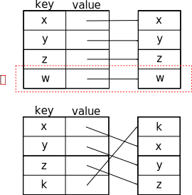
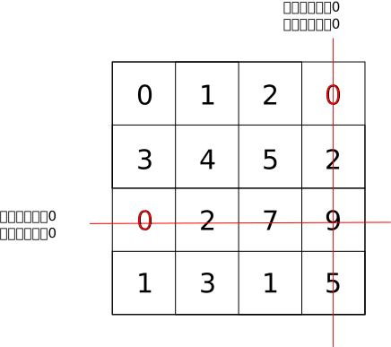

==========
PayPal题库
==========

.. default-role:: math

收到了PayPal的面试呀，来刷一遍PayPal的题目吧。

.. contents::
    :backlinks: none

机器人出不出圈
=============

`Leetcode 1041 <https://leetcode.com/problems/robot-bounded-in-circle/>`_

    给一组指令， ``G`` 表示往前走一格、 ``L`` 表示左转、 ``R`` 表示右转。机器人一开始头朝前。机器人循环执行这一组指令，机器人的轨迹是有界的吗？

只要执行一次整组指令，然后看机器人

-   位置是否不在原点
-   并且头是不是朝着前

如果这两个条件都满足，机器人的轨迹一定是无界的。

翻遍了评论区也没有找到严格证明。

.. literalinclude:: 1041.py
    :language: python

按ZigZag顺序格式化字符串
======================

`Leetcode 6 <https://leetcode.com/problems/zigzag-conversion/>`_

非常无聊的一道题……而且我怀疑是PayPal出的题。

    给一个字符串、行数，把字符串按往下、右斜上方、再往下这样循环输出。

比如给

::

    PAYPALISHIRING, 3

变成

::

    P A H N
    APLSIIG
    Y I R

然后再按从左到右、从上到下顺序输出，变成

::

    PAHNAPLSIIGYIR

真的是非常无聊。

观察一下字符的排列方式

-   0到 `n - 1` 是从上到下排
-   `n - 1` 到 `2n - 1` 是从下往上排
-   `2(n - 1)` 到 `3(n - 1)` 又是从上往下

不如从格式化之后的行数来看，我们往每一行追加字符的顺序是

-   `0, 1, ..., n - 1`
-   `n, n - 1, ..., 1`
-   `0, 1, ..., n - 1`

可以看出就是

.. math::

    0, 1, 2, ..., n - 1, n, n - 1, n - 2, ..., 1

不停循环

在Python里这个迭代器可以这么写

.. code-block:: python

    itertools.cycle(itertools.chain(range(n), reversed(range(1, n - 1))))

括号好多……Rust就好看许多

.. code-block:: rust

    (0..n).chain((1..n - 1).rev())

注意Rust里 ``(0..10)`` 这种 ``Range`` 本身就已经是一个 ``Iterator`` 了， ``(0..10).iter()`` 是错的。

所以给每一横排建一个列表，然后按顺序生成行数，遍历字符串，追加到对应的那一行就好了。

.. literalinclude:: 6.py
    :language: python

.. literalinclude:: 6.rs
    :language: rust

两个元素下标的最小距离
====================

`Leetcode 243 <https://leetcode.com/problems/shortest-word-distance/>`_

    给一个array，里面有好多元素，有重复元素。再给你两个元素 ``a, b`` ，所有 ``a`` 出现的下标、和所有 ``b`` 出现的下标的差的绝对值的最小值是多少。

就是求

.. math::

    \min\left\{|i - j| \middle| a = a_i, b = a_j \right\}

很简单啦，先把 ``a, b`` 出现的下标全部找出来，再一个一个对比就好了。

.. literalinclude:: 243.py
    :language: python

Two sum
=======

`Leetcode 1 <https://leetcode.com/problems/two-sum/>`_

    给一个array，array里是否存在两个数字加起来正好是 `t` ？它们的坐标是什么？

用hash map存目前为止见过的所有的数（作为key）和数字的出现的位置（作为value），遍历array，对于每个元素 `b` ，都去hash map里找是否存在 `t - b` 这个数字。因为 `b + t - b = t` 。

.. code-block::

    from typing import *

    class Solution:
        def twoSum(self, nums: List[int], target: int) -> List[int]:
            seen = {}

            for i, v in enumerate(nums):
                if target - v in seen:
                    return [i, seen[target - v]]
                else:
                    seen[v] = i

            return [0, 0]

实现LRU缓存
===========

`Leetcode 146 <https://leetcode.com/problems/lru-cache/>`_

    实现least recently used缓存。

所谓least recently used就是上一次使用时间最远。当缓存容量满的时候，寻找上一次时间最远的那个元素，从缓存里删掉，给新元素腾出空间。

这道题刚做不久，但是已经忘光了，看来人脑也是个LRU缓存……那再来分析一下。

单独用一个hash map肯定是不够的，因为hash map虽然能在 `O(1)` 判断元素是否存在，但是没法做到保存元素的顺序。单独用一个array肯定也是不够的，因为array虽然能做到保存元素顺序，但是做不到 `O(1)` 判断某个元素是否在array里。

所以基本确定这道题是用一个hash map和一个array做。问题是hash map的key、value和array的value分别存什么呢？

首先能确定，hash map的key肯定只能存cache的内容，因为需要 `O(1)` 判断内容是否在cache里，这个没得商量。

需要腾出位置的时候，要读array最后一个格子的内容，快速确定是哪个内容要从cache里删掉，所以array里必须也存cache的内容，也就是和hash map的key保持一致。

到这里都没有问题，我们继续研究hash map的value应该存什么。读出内容之后，还要把这个内容的最近访问时间提到最前面，这件事情，array是做不到的……想想如果用hash map的value存的是下标，某个中间的内容最近被访问了，中间的格子要出来、放到最前面，这样的话前面这么多个格子的下标全部都会变。

    没空间可用的时候，要删掉 ``w`` 给 ``k`` 腾出空间，但是这样一来， ``k`` 的访问时间变成最近了， ``x, y, z`` 都要往后移动。

我记得amazon的文章里我好像做过这个图了……

所以只能用linked list了。

.. literalinclude:: 146.py
    :language: python

螺旋遍历矩阵
===========

`Leetcode 54 <https://leetcode.com/problems/spiral-matrix/>`_

    给一个矩阵，按左上角到右上角、右上角到右下角、右下角到左下角、左下角到左上角、再到内层的顺序遍历。

比如给

.. math::

    \left(\begin{matrix}
        1 & 2 & 3 & 4 \\
        5 & 6 & 7 & 8 \\
        9 & 10 & 11 & 12 \\
    \end{matrix}\right)

输出

::

    1, 2, 3, 4, 8, 12, 11, 10, 9, 5, 6, 7

很简单，用递归就好了，像剥洋葱一样一层一层剥开来就好了。

假设矩阵是 `n \times m` 的，那么最外层怎么剥呢？最外层的下标是

.. math::

    \overbrace{(0, 0)}^\text{左上角}, (0, 1), ..., \overbrace{(0, m - 1)}^\text{右上角}, (1, m - 1), (2, m - 1), ..., \underbrace{(n - 1, m - 1)}_\text{右下角}, (n - 1, m - 2), (n - 1, m - 3), ..., (n - 1, 1), \underbrace{(n - 1, 0)}_\text{左下角}, (n - 2, 0), ..., (1, 0)

分成四段

-   左上角到右上角前 `(0, 0), (0, 1), ..., (0, m - 2)`
-   右上角到右下角前 `(0, m - 1), (2, m - 1), ..., (n - 2, m - 1)`
-   右下角到左下角前 `(n - 1, m - 1), (n - 1, m - 2), ..., (n - 1, 1)`
-   左下角到左上角前 `(n - 1, 0), (n - 2, 0), ..., (1, 0)`

分别对应四个迭代器

-   ``(0, i) for i in range(m - 1)``
-   ``(i, m - 1) for i in range(n - 1)``
-   ``(n - 1, i) for i in reversed(range(1, m))``
-   ``(i, 0) for i in reversed(range(1, n))``

Python里就用 ``itertools.chain()`` 把四个迭代器串起来就好了。

.. literalinclude:: 54.py
    :language: python

两个词是否是颠倒字母顺序形成的
==========================

`Leetcode 242 <https://leetcode.com/problems/valid-anagram/>`_

    给两个字符串 ``s, t`` ，问 ``s, t`` 是否含有相同种类的字母、并且每种字母在各自字符串里出现的参数相同。

比如给

-   ``s = "anagram"``
-   ``t = "nagaram"``

发现 ``s, t`` 都含有

-   3个 ``a``
-   1个 ``n``
-   1个 ``m``
-   1个 ``g``

最容易想到的就是用hash map，统计每个词里每个字母出现的次数，然后比较这两个hash map是否完全相等。

.. literalinclude:: 242.py
    :language: python

用 ``collections.Counter`` 只要一行

.. code-block::

    return collections.Counter(s) == collections.Counter(t)

数列里有多少对差的绝对值正好是 `k` 的数对
====================================

`Leetcode 532 <https://leetcode.com/problems/k-diff-pairs-in-an-array/>`_

    给一个数列，其中有多少对数 `(v, w), v \leq w` 满足 `|v - w| = k` ？

比如给 `k = 2` 和

::

    3, 1, 4, 1, 5

就有

-   ``(1, 3)``
-   ``(3, 5)``

满足条件。虽然里面有两个1，但是只算一对。

要注意比较坑的test case，比如 `k < 0` 的情况……绝对值怎么可能小于零呢？所以这时候就直接返回0。

还有是 `k = 0` 的情况，要特殊处理。比如给 `k = 0` 和

::

    1, 2, 1, 1

的时候，答案是1，因为只有一对 ``(1, 1)`` 满足条件。但是如果给 `k = 0` 和

::

    1, 2, 3, 4

那么答案又变成0了。

.. literalinclude:: 532.py
    :language: python

能理解这题为什么得分这么低了……

实现支持 ``peek()`` 的迭代器
==========================

`Leetcode 284 <https://leetcode.com/problems/peeking-iterator/>`_

    众所周知，迭代器的 ``next()`` 是 **取出** 下一个元素，但是如果我不想取出呢？我只想看看，不想拿出来的。实现一个和stack一样的 ``peek()`` 方法。

很简单，内部搞一个cache，暂存一下内部那个迭代器的第一个元素。每次 ``peek()`` 就返回这个cache。每次 ``next()`` 就返回这个cache，再取出内部迭代器的下一个元素，放到cache里。

如果cache是空的，就说明取完了。

.. literalinclude:: 284.py
    :language: python

Subsequence sum
===============

虽然题号里有subset sum，但是并不是严格的集合，因为允许重复元素。所以这里标题改成了subsequence sum。

`Leetcode 416 <https://leetcode.com/problems/partition-equal-subset-sum/>`_

    给一个全是整数的array，这个array存不存在一个subsequence（可以不连续），它的累加和正好是整个array的累加和的一半？

这个一半没什么特别的，并不能让问题变简单，换成任意的 `t` 也是一样的，所以问题等价于

    给一个全是整数的array，这个array存不存在一个subsequence（可以不连续），它的累加和正好 `t` ？

看到题目惊了，subset sum不是NP hard吗，怎么这种题目都搬出来了。一想哦原来是整数subset sum，那么伪多项式阶用动态规划 [#pseudo-polynomial]_ 还是能解的。

设 ``dp[i]`` 是array的前 `i` 个数字各种组合、能凑成的所有可能的和。那么 ``dp[i]`` 和前面的项有什么关系呢？假设第 `i` 个数字是 `a_i` ，那么

-   `a_i` 单独可能成一个累加和
-   `a_i` 可以和前面的所有累加和加起来，形成新的和

所以递推式很容易写

.. math::

    \text{OPT}(i) = \text{OPT}(i - 1) \cup \{a_i\} \cup \{a_i + v | v \in \text{OPT}(i - 1)\}

如果这样做其实复杂度和暴力一样……但是有个优化可以用一下。

有没有发现array里面每个数字都是正整数？那么如果 ``dp[i - 1]`` 里面的某个和 `v` 已经大于 `t` 了，这个数字还需要保留到 ``dp[i]`` 里面吗？显然不用保留了，因为再继续保留下去，和 `a_i` 加一下只会变得更大、离 `t` 更远。

所以加一个条件判断，所有大于 `t` 的数字都没有必要保留

.. math::

    \text{OPT}(i) = \text{OPT}(i - 1) \cup \{a_i\} \cup \{a_i + v | v \in \text{OPT}(i - 1), a_i + v \leq t\}

这样，任意一个 ``dp[i]`` 的大小都不会超过 `t + 1` ，所以算法的复杂度和转化成01背包问题一样，都是伪多项式阶 `O(n t)` 。

还可以优化空间复杂度。观察递推式， ``dp[i]`` 只和 ``dp[i - 1]`` 有关，和 ``dp[i - 2], dp[i - 3]`` 都没有关系，所以每次只要保存上一轮的结果就可以了。

.. literalinclude:: 416.py
    :language: python

.. [#pseudo-polynomial] 关于NP hard和伪多项式阶可以看我的 :doc:`这篇文章 <../reduction-np>` 呀。

把array里所有的0都移动到最后
=========================

`Leetcode 283 <https://leetcode.com/problems/move-zeroes/>`_

    给一个array，用尽可能少的操作，把里面所有0都移到array的最后面，保持其他非0元素的相对位置。

比如给

::

    0, 1, 0, 3, 12

要尽可能用最少的操作做到

::

    1, 3, 12, 0, 0

如果要暴力做是很简单的，遇到一个0，就把它从array里面拿出来，然后放到最后。问题是，假设第一个元素就是0，把它拿出来之后，后面的 `n - 1` 个元素要依次顺位往前，这个开销就很大了。

那能不能用小水滴聚成大水滴、大水滴往后移动的方法？用两个指针表示大水滴的范围，范围内的数字全是 ``0`` ，然后水滴不断往右移动，遇到 ``0`` 就吸收、遇到不是 ``0`` 的就让这个数和水滴最前面的 ``0`` 交换位置。

::

    0, 1, 0, 3, 12
    ^
    ^

发现右边是 ``1`` ，所以调换 ``0, 1``

::

    1, 0, 0, 3, 12
       ^
       ^

发现右边是 ``0`` ，把水滴范围扩大

::

    1, 0, 0, 3, 12
       ^  ^

右边遇到了 ``3`` ，怎么办？让 ``3`` 和水滴最前面的 ``0`` 调换位置

::

    1, 3, 0, 0, 12
          ^  ^

右边遇到了 ``12`` ，还是让 ``12`` 和水滴最前面的 ``0`` 调换位置

::

    1, 3, 12, 0, 0
              ^  ^

水滴已经移动到最右边了，结束。

这样算下来总共交换了3次，如果把写入array作为基本操作，那么做了6次操作。如果用暴力的做法

-   第一次把最前面的 ``0`` 拿出来放到最后需要5次操作
-   第二次把中间的  ``0`` 拿出来放到最后需要4次操作

总共9次操作。

最极端的test case应该是这种

::

    0, 0, 0, 0, ..., 0, 1

如果暴力，需要 `O(n^2)` 次操作。用这种水滴的方法就只要1次操作。

.. literalinclude:: 283.py
    :language: python

我也不知道我是怎么想到这个方法的，可能这就是灵感？

`k` 个 `k` 个颠倒链表
====================

`Leetcode 25 <https://leetcode.com/problems/reverse-nodes-in-k-group/>`_

    给一个链表，把元素分成 `k` 个一组，分组颠倒。最后一组如果不满 `k` 个就不要颠倒。

大概就是给 ``1, 2, 3, 4, 5`` 分2组颠倒的话得到

::

    2, 1, 4, 3, 5

分3组颠倒的话就是

::

    3, 2, 1, 4, 5

记得好像最近做过这题了……但是我又忘了，再做一遍吧。

.. literalinclude:: 25.py
    :language: python

颠倒链表
=======

`Leetcode 206 <https://leetcode.com/problems/reverse-linked-list/>`_

这个就更简单了。数据结构基本操作啦。

迭代的做法，用动画更容易理解。先建一个假节点 ``sentinel``

::

    sentinel -> null

然后每次都从原链表抽出最前面的第一个节点，插入到 ``sentinel`` 的后面。比如 ``1, 2, 3, 4, 5`` 的话，就先抽出 ``1`` ，插入到 ``sentinel`` 后面

::

    sentinel -> 1 -> null

    2 -> 3 -> 4 -> 5 -> null

继续

::

    sentinel -> 2 -> 1 -> null

    3 -> 4 -> 5 -> null

继续

::

    sentinel -> 3 -> 2 -> 1 -> null

    4 -> 5 -> null

继续

::

    sentinel -> 4 -> 3 -> 2 -> 1 -> null

    5 -> null

继续

::

    sentinel -> 5 -> 4 -> 3 -> 2 -> 1 -> null

    null

结束，返回 ``sentinel.next`` 就好了。

.. literalinclude:: 206.py
    :language: python

从链表里删除节点
==============

`Leetcode 237 <https://leetcode.com/problems/delete-node-in-a-linked-list/>`_

    给一个节点，不给你链表头，删掉那个节点。

我一开始的想法是把这个节点后面的所有节点的值都顺次移到前面一个节点……看了答案发现不用这样，直接让当前的节点的值变成后面一个节点的值，然后把当前节点的 ``next`` 跨过后面一个节点、直接指向后面的后面一个节点就可以了。

.. literalinclude:: 237.py
    :language: python

二叉树的右视图
============

`Leetcode 199 <https://leetcode.com/problems/binary-tree-right-side-view/>`_

    给一个二叉树，输出从二叉树的右边向左边看到的部分。

把二叉树想成一个纸片，然后头在右边、眼睛向左看。

我记得这是三月我去加联创被问的题……然后我当时还没开始做树的题，没答出来，好尴尬。

.. literalinclude:: 199.py
    :language: python

二叉树按层遍历
============

`Leetcode 102 <https://leetcode.com/problems/binary-tree-level-order-traversal/>`_

不说了，每天都写。

.. literalinclude:: 102.py
    :language: python

累加和最大的substring
====================

`Leetcode 53 <https://leetcode.com/problems/maximum-subarray/>`_

    给一个array，问其中累加和最大的substring（要连续）的累加和是多少？

这种又是累加和又是substring的用prefix sum秒做。

.. literalinclude:: 53.py
    :language: python

二叉树中两个节点的最近公共祖先
==========================

`Leetcode 236 <https://leetcode.com/problems/lowest-common-ancestor-of-a-binary-tree/>`_

    给一个二叉树、两个节点，找到这两个节点最近的公共祖先。

我的做法是找到从root分别到两个节点的路径，然后两个路径diff一下，找到第一个不同的元素。

当然其实没必要做diff，可以把其中一个节点到根的路径上每个节点都存在hash set里，然后另一个节点顺着往上走，遇到的第一个在hash set里的祖宗就是这两个节点的公共节点。

.. literalinclude:: 236.py
    :language: python

判断某个值是否在排好序的矩阵里
==========================

`Leetcode 240 <https://leetcode.com/problems/search-a-2d-matrix-ii/>`_

    有个性质非常好的矩阵：每行从左到右都是从小到大排列的、每列从上到下也是从小到大排好序的。快速判断某个值是否在这个矩阵里。

比如给

.. math::

    \left(\begin{matrix}
        1 & 4 & 7 & 11 & 15 \\
        2 & 5 & 8 & 12 & 19 \\
        3 & 6 & 9 & 16 & 22 \\
        10 & 13 & 14 & 17 & 24 \\
        18 & 21 & 23 & 26 & 30 \\
    \end{matrix}\right)

要快速判断出 ``5`` 在里面、 ``20`` 不在里面。

官方解答讲的天花乱坠，我也不整那些有的没的了，一行一行遍历，如果发现要找的数有可能在这一行里，就在这一行里二分搜索一下。复杂度顶破天也就是 `O(m \ln n)` 。最坏情况每行都二分，也不亏。

.. note:: 开个脑洞，如果这个矩阵是个瘦长的矩阵，就是 `m > n` 的话，是不是可以想办法先把矩阵转置一下，变成一个矮胖的矩阵？这样复杂度就从 `O(m \ln n)` 变成 `O(n \ln m)` ，又省了一点了。

有两个小优化。第一个小优化是，一旦发现这一行的第一个数都比target大，那么没必要找下去了，为什么呢？

-   首先target不可能出现在这一行了
-   之后的所有行，行首的第一个数只会越来越大，所以target也不可能出现在这一行之后的所有行了

另一个小优化是，如果发现这一行最后一个数比target小，那么直接略过这一行，往下一行去就完事儿了。

.. literalinclude:: 240.py
    :language: python

顺便如果要手写二分搜索的话，回忆一下定位最左边、最右边的代码，直接从 `维基百科 <https://en.wikipedia.org/wiki/Binary_search_algorithm>`_ 抄过来。

定位最左边的 **插入位置**

.. code-block:: python

    left = 0
    right = len(array)

    while left < right:
        middle = (left + right) // 2 # 顺便这里可能会问你溢出怎么办，改成left + (right - left) // 2就好了。不过反正python根本没有溢出
        if array[middle] < target:
            left = middle + 1
        else:
            right = middle

    return left

定位最右边的 **插入位置**

.. code-block:: python

    left = 0
    right = len(array)

    while left < right:
        middle = (left + right) // 2
        if array[middle] > target:
            right = middle
        else:
            left = middle + 1

    return right
    # 维基上是return right - 1，但是我想找插入位置

这样不太好记， ``if`` 的两个臂交换位置了，不如

.. code-block:: python

    left = 0
    right = len(array)

    while left < right:
        middle = (left + right) // 2
        if array[middle] <= target:
            left = middle + 1
        else:
            right = middle

    return right

但还是要记着一个是小于一个是大于，还是不太好记。

分析一下，定位最左和定位最右的区别只有两处

-   ``array[middle] == target`` 的时候，定位最左是让 ``right = middle`` ，定位最右是让 ``left = middle + 1``
-   最后返回插入位置的时候，定位最左是 ``return left`` ，定位最右是 ``return right``

所以不如把 ``array[middle] == target`` 的情况单独拿出来。不谈了，这是终极版，Python的 ``bisect`` 库 `也是这么写的 <https://github.com/python/cpython/blob/master/Lib/bisect.py>`_ 。

.. code-block:: python

    def bisectLeft(array: List[Type], target: Type) -> int:
        if len(array) == 0:
            return 0

        left = 0
        right = len(array)

        while left < right:
            middle = (left + right) // 2
            if array[middle] == target:
                right = middle
            elif array[middle] < target:
                left = middle + 1
            elif array[middle] > target:
                right = middle

        return left

    def bisectRight(array: List[Type], target: Type) -> int:
        if len(array) == 0:
            return 0

        left = 0
        right = len(array)

        while left < right:
            middle = (left + right) // 2
            if array[middle] == target:
                left = middle + 1 # 区别
            elif array[middle] < target:
                left = middle + 1
            elif array[middle] > target:
                right = middle

        return right # 这里left、right都行，反正相等

看了篇 `神文 <https://labuladong.gitbook.io/algo/di-ling-zhang-bi-du-xi-lie/er-fen-cha-zhao-xiang-jie>`_ ，讲的巨好。

.. note:: 我甚至还想给 ``bisect`` 加上自定义key function的功能。不知道为什么这个功能一直没有加入 ``bisect`` 。

    .. code-block:: python

        def bisectLeft(array: List[Type], target: Type, key=None) -> int:
            if len(array) == 0:
                return 0

            left = 0
            right = len(array)

            if key == None:
                key = lambda v: v

            while left < right:
                middle = (left + right) // 2
                if key(array[middle]) == key(target):
                    right = middle # 区别
                elif key(array[middle]) < key(target):
                    left = middle + 1
                elif key(array[middle]) > key(target):
                    right = middle

            return left # 这里left、right都行，反正相等

验证括号嵌套
===========

`Leetcode 20 <https://leetcode.com/problems/valid-parentheses/>`_

    给一些由 ``(, ), [, ], {, }`` 组成的字符串，问你这个字符串符不符合括号嵌套规则。

所谓括号嵌套规则我也说不清，大概就是括号成不成对的意思吧。比如

::

    ()[]{}

成对，但是

::

    ([)]

不成对。

这题是stack的经典应用。但是我说不清这题为什么用stack能解决。 [#stack]_ 

.. literalinclude:: 20.py
    :language: python

.. [#stack] 我对stack、queue这些真的理解不够深入，很多时候答案给我我都看不懂。大概是没上过数据结构的原因。

给颜色排序
=========

`Leetcode 75 <https://leetcode.com/problems/sort-colors/>`_

    不用额外空间，给只含有 ``0, 1, 2`` 的array排序。

感觉像是 `把array里所有的0都移动到最后`_ 的翻版诶……先把所有的1移动到后面、再把所有的2移动到后面。要扫两遍，第一遍扫1，第二遍扫2。

这样做也挺快的。

.. literalinclude:: 75.py
    :language: python

但是题目说还有只要扫描一遍就可以的做法。我仔细想了下，竟然也能想到。

像 `把array里所有的0都移动到最后`_ 里面，水滴里面只有 ``0`` ，但是其实最多可以有2种元素的，像这道题里，水滴里可以有 ``1`` 和 ``2`` 。在水滴内部， ``1`` 永远在前面、 ``2`` 永远在后面，也就是说，水滴在往右边移动的过程，遇到 ``0`` 放到水滴外面的左边，遇到 ``1`` 放到水滴里面的左边，遇到 ``2`` 放到水滴里面的右边。这样水滴移动到最右的时候，水滴外面的左边全是 ``0`` ，而水滴内部的左半边全是 ``1`` ，右边全是 ``2`` ，也就间接达到了排序的目的了。

一开始我想改造上面的做法，还是只用两个指针 ``left, right`` ，但是纸上试了一下发现不行，还需要另一个指针，来表示水滴内部 ``1, 2`` 的分界点，就叫 ``middle`` 吧。

比如

::

     2 0 2 1 1 0
    |               left, right
    |               middle

一开始 ``left, middle, right`` 全都在0处，右边是 ``2`` ，所以要吸收到水滴里面来，而且是放在水滴的右半部分

::

     2 0 2 1 1 0
    | |
    |

右边是 ``0`` ，要排除到水滴外面，放在水滴外面的左边。怎么办呢？直接交换 ``array[left], array[right]`` 就好了嘛，交换完之后，水滴整体往右移动，也就是三个指针同时往右移动1格

::

     0 2 2 1 1 0
      | |
      |

现在右边又遇到了 ``2`` ，吸收到水滴内部的右半边，所以直接 ``right`` 右移一格就可以了

::

     0 2 2 1 1 0
      |   |
      |

右边遇到了 ``1`` ，吸收到水滴内部的左半边，同样是交换 ``array[right], array]left]`` ，但是水滴内部出现了 ``1`` 的部分，所以 ``middle`` 也要往右移动一格；水滴变大了， ``right`` 也要右移

::

     0 1 2 2 1 0
      |     |
        |

还是遇到了 ``1`` ，还是按刚才同样的操作

::

     0 1 1 2 2 0
      |       |
          |

遇到了 ``0`` ，而且水滴内部既有 ``1`` 也有 ``2`` ，这是最麻烦的一种情况，不过也麻烦不到哪里去，需要轮换 ``array[left], array[middle], array[right]`` 。

啥叫轮换呢，就是

::

    1 2 3

变成

::

    3 1 2

这样变成了

::

    0 0 1 1 2 2
       |       |
           |

搞定了！

我居然也能自己想出算法来了，膨胀了。

.. literalinclude:: 75-2.py
    :language: python

遇到 ``0`` 就把这行这列全设成 ``0``
===============================

`Leetcode 73 <https://leetcode.com/problems/set-matrix-zeroes/>`_

    给一个矩阵，把所有 ``0`` 出现的那一整行、一整列全部变成 ``0`` 。

看上去挺简单的啊，遍历一遍，把所有需要置 ``0`` 的行号、列号记下来，然后再设置就好了。

但是问题下面有个要求是要用 `O(1)` 空间，那如果我们这样做的话，用的空间是 `O(m + n)` 。

看了答案大概懂了，写了个类似的，但没他那么精炼。

原理就是，像excel或者pandas的表格一样，把矩阵的最左边一列当做是index、最上面一行当做是column（如果你用过pandas应该会理解我说的），最左边一列用来标记这一行是否需要全部涂0，最上面一行用来标记这一列是否需要全部涂0。

    这一行第一个如果是0，表示这行全部涂0。同理如果这一列第一个如果是0，表示这列全部涂0。

那第一行、第一列本身怎么处理？需要特殊处理。不过也很简单，先扫第一行，如果发现第一行有 ``0`` ，就记下；扫第一列，如果发现有 ``0`` ，也记下。等到中间的全部搞好了，最后再来处理第一行和第一列。

.. literalinclude:: 73.py
    :language: python

列出所有组合
===========

`Leetcode 46 <https://leetcode.com/problems/permutations/>`_

    给一些不相同的数，输出这些数所有可能的排列组合。

比如给 ``1, 2, 3`` ，输出

::

    1, 2, 3
    1, 3, 2
    2, 1, 3
    2, 3, 1
    3, 1, 2
    3, 2, 1

差不多就是实现 ``itertools.permutations()`` 的感觉。

整个array除了自己的以外的积
==========================

`Leetcode 238 <https://leetcode.com/problems/product-of-array-except-self/>`_

    给一个array，对其中每个元素 `a_i` 都计算出整个array除了 `a_i` 以外的那个subsequence的积。

类似前缀和，只不过不是累加 **和** ，而是累加 **积** 。假设

-   ``productBefore[i]`` 表示 `a_0 a_1 \cdots a_{i - 1}`
-   ``productAfter[i]`` 表示 `a_i a_{i + 1} \cdots a_{n - 1}`

那么第 `i` 个元素的结果就是 ``productBefore[i] * productAfter[i + 1]`` 。

.. literalinclude:: 238.py
    :language: python

Python只提供了累加和的函数 ``itertools.accumulate()`` 没有提供累加积的。Rust啥也没提供，提供了一个叫 ``Iterator.scan()`` 的 `函数 <https://doc.rust-lang.org/std/iter/trait.Iterator.html#method.scan>`_ 。

题目还说只能用 `O(1)` 空间（不包括输出占用的空间）。那怎么究极省空间呢？我觉得可以先把 ``productAfter`` 整个算出来，放在输出里，然后再一边遍历一边算 ``productBefore[i]`` 、顺便覆盖输出。这样自始至终就只需要输出空间了。

.. literalinclude:: 238-2.py
    :language: python

合并几个排好序的链表
==================

`Leetcode 23 <https://leetcode.com/problems/merge-k-sorted-lists/>`_

    给几个从小到大排好序的链表，合并成一个大链表。

这个是merge sort里的其中一步。用分治法，两个两个合并，最后合并成一个大链表，这样复杂度是 `O(n \ln k)` ， `k` 是有多少个链表， `n` 是链表的长度。

看上去很简单，但是里面需要处理的细节巨多，比如

-   万一 ``lists`` 是空的怎么办？
-   万一 ``lists`` 里面有空链表怎么办？

.. literalinclude:: 23.py
    :language: python

3 sum
=====

`Leetcode 15 <https://leetcode.com/problems/3sum/>`_

    给一个array，输出所有 `a_i, a_j, a_k` ， `i < j < k` ，使得 `a_i + a_j + a_k = t` 。

归约到2 sum。

.. literalinclude:: 15.py
    :language: python

面试体验
========

2020/3/11下午面的。到现在也没理我约二面，所以大概是凉了吧……

问了一道桶排序。很尴尬的是我忘了这个叫桶排序，不停地说这个count and say……好在代码2 min就写出来了。然后问我复杂度是多少。

然后问了一道房间找钥匙的题目，也是 `原题 <https://leetcode.com/problems/keys-and-rooms>`_ ，我有印象，而且周赛貌似出现过类似的，前几周刚刚 `做过 <https://leetcode.com/problems/maximum-candies-you-can-get-from-boxes/>`_ ，所以也是直接BFS几分钟就写出来了。

这两题过去了我感觉非常良好……然后就开始作死了，被问了一道二叉树preorder的非递归写法。这个我会！面试之前特意看了一下，啊啊啊啊，太好了。用stack秒做。

然后就开始尴尬了，小姐姐问我那postorder的非递归怎么写……这里卡了15 min，最后我终于发现postorder可以通过preorder稍加改动 [#]_ 、最后整体颠倒。

不知道什么时候二面呢……

2020/3/23

今天下午告诉我一面挂了，也不告诉我原因是啥。好气啊。

2020/3/30

.. [#] 原来preorder里面，stack是先放right、再放left，改成先放left、再放right。