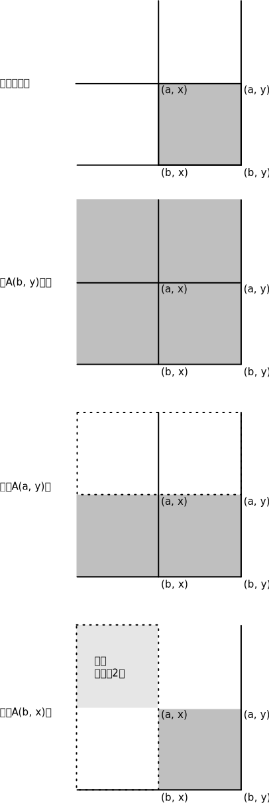

============
前缀和太好用了
============

.. default-role:: math

.. contents::
    :backlinks: none

前缀和这个技巧真的太好用了，值得写一篇夸一下。感觉它可以用在一切和substring sum（连续子序列和）有关的场合。

还有一个好处是，用了前缀和之后，这题目其实和原来那个数组没关系了，变成了一道完全只和前缀和序列有关的类似2 sum的题目。

设 `A_i` 是数列 `a_0, a_1, ..., a_{i - 1}` 的和，那么有

.. math::

    a_i + a_{i + 1} + \cdots + a_{j - 1} = A_j - A_i

如果 `i` 和 `j` 距离很远的话，频繁计算左边式子就很花时间，所以不如在 `O(n)` 内先算出每个 `A_i` 存下来，需要用的时候直接 `A_j - A_i` ，这样 `O(1)` 就能计算任意一段substring sum了。

.. note:: 你不觉得这个式子

    .. math::

        \underbrace{a_i + a_{i + 1} + \cdots + a_{j - 1}}_{\sum_{k = i}^{j - 1} a_k} = A_j - A_i

    和 `微积分基本定理 <https://en.wikipedia.org/wiki/Fundamental_theorem_of_calculus#Corollary>`_

    .. math::

        \int_a^b f(x) \,dx = F(b) - F(a)

    很像吗。

    我还想到了 `概率、概率密度函数、概率分布函数之间的关系 <https://en.wikipedia.org/wiki/Cumulative_distribution_function#Definition>`_

    .. math::

        P(a < X \leq b) = \int_a^b f(x) \,dx = F(b) - F(a)

用Python的话，算这个很简单，可以用标准库函数

.. code-block:: python

    import itertools

    integral = [0] + list(itertools.accumulate(array)) # 最前面补一个0，这样非常优雅，integral[j] - integral[i]就直接是array[i: j]的和了
    # assert integral[j] - integral[i] == sum(array[i: j])

典型题
======

来几道例题吧。

Substring sum
-------------

这道是标准的substring sum

    给一个数组， **是否存在** 某个substring的和是 `t` ？

直接遍历每个 `A_j` ，看前面存不存在一个 `A_i` 正好满足 `A_j - A_i = t` 。但是这样做的话，复杂度还是 `O(n^2)` ，因为对每个 `A_j` ，都要扫描一遍 `A_0` 到 `A_{j - 1}` 。什么数据结构可以做到快速判断一个元素是否存在？

集合啊。那就用集合把 `A_0` 到 `A_{j - 1}` 存起来，然后遍历到 `A_j` 的时候，只要看集合里面是否存在 `A_j - t` 这个数字就好了。如果不存在，不要忘了先把 `A_j` 加入集合，然后再到下一个迭代。

.. code-block:: python

    class Solution:
        def substringSum(self, array: List[int], t: int) -> bool:
            integral = [0] + list(itertools.accumulate(array)) # 算出A_i
            seen = set() # 把至今见过的A_i都存起来

            for v in integral: # v = A_j
                if v - t in seen: # 如果A_j - t之前见过
                    return True # 那么存在
                else:
                    seen.add(v) # 别忘了把当前积分项加入到见过的数的集合里

            return False # 转了一圈都不存在

这样复杂度做到了 `O(n)` 。这个是不是有点 `2 sum <https://leetcode.com/problems/two-sum/>`_ 的感觉？

多少个和是 `k` 的substring
------------------------

下面这道是稍微进阶一点的， `Leetcode 560 <https://leetcode.com/problems/subarray-sum-equals-k/>`_

    给一个数组，存在 **多少个** 和是 `k` 的substring？

和标准题没什么区别，唯一的区别是，集合改成map，记录一下每个数出现的次数。遍历到 `A_j` 的时候，往前看看前面有多少个 `A_i` 满足 `A_j - A_i = k` 。

.. code-block:: python

    class Solution:
        def subarraySum(self, nums: List[int], k: int) -> int:
            integral = [0] + list(itertools.accumulate(nums)) # 算出A_i
            counter = collections.Counter() # 至今为止见过的每个数字及其出现的次数
            res = 0 # 至今为止见到的和正好为k的substring的个数

            for v in integral: # 遍历每个A_j
                res += counter[v - k] # 前面见过的每个满足A_j - A_i = k的A_i都可以和A_j配对，每个满足A_j - A_i = k的i都满足a_i + a_{i + 1} + ... + a_{j - 1} = k
                counter[v] += 1 # 别忘了把当前这一项出现的次数+1

            return res

复杂度还是 `O(n)` 。

多少个和在区间内的substring
------------------------

下一题， `Leetcode 327 <https://leetcode.com/problems/count-of-range-sum/>`_

    给一个数组，存在 **多少个** 和在 `[l, r]` 区间内的substring

一样的套路，只不过前面见过的每个满足 `A_j - A_i \in [l, r]` 的 `A_i` 都可以配对，所以乍一看好像还是 `O(n^2)` 。可以从反方向考虑，对 `[l, r]` 里的每个整数 `t` ，都去数前面满足 `A_j - A_i = t` 的 `A_i` 。

这样复杂度是 `O(n (r - l))` ，不是多项式阶，是 **伪多项式阶** 。因为复杂度式子中出现了 `r - l` ，是输入的值、而不是输入的规模。

.. code-block:: python

    class Solution:
        def countRangeSum(self, nums: List[int], lower: int, upper: int) -> int:
            integral = [0] + list(itertools.accumulate(nums)) # 计算A_i
            counter = collections.Counter() # 数前面每个数字出现次数
            res = 0 # 至今发现了多少个和在[l, r]内的substring

            for v in integral: # 遍历每个A_j

                for t in range(lower, upper + 1): # 往前找所有满足A_j - A_i = t, t in [l, r]的A_i
                    res += counter[v - t] # 前面的每个满足A_j - A_i = t, t in [l, r]的A_i都可以和A_j配对
                
                counter[v] += 1

            return res

需要转个弯的问题
==============

上面三道是比较容易看出用前缀和解决的。下面的题目就不那么容易看出可以用前缀和搞定了。

是否能拆成三个和相等的substring
---------------------------

比如这一道 `Leetcode 1013 <https://leetcode.com/problems/partition-array-into-three-parts-with-equal-sum/>`_

    给一个数列， **能不能** 把这个数列正好拆分成三个substring、并且这三个substring各自的累加和相等？

比如

::

    0, 2, 1, -6, 6, -7, 9, 1, 2, 0, 1

可以拆分成

-   ``0, 2, 1``
-   ``-6, 6, -7, 9, 1``
-   ``2, 0, 1``

这三个substring，同时这三个substring的累加和都是3。

这个怎么做呢？如果用暴力做法做，就是要在数组里找两个分裂位置，然后把数组拆分成三个substring，测试每个substring的累加和是否相等。一个长 `n` 的数组总共有 `n - 1` 个分裂点，比如 ``1, 2, 3, 4`` 长度为4、有3个分裂点。所以一个长度是 `n` 的数组总共有 `C_{n - 1}^2` 种拆分成三个substring的方法。因为 `C_{n - 1}^2 \in O(n^2)` ，所以暴力做法复杂度至少是 `O(n^2)` ，这还不带算上每次求每个substring的复杂度（当然如果用前缀和的话，算substring的复杂度就是 `O(1)` 了）。

不就是要找一对 `0 < i < j < n` ，使得

.. math::

    a_0 + a_1 + \cdots + a_{i - 1} = a_i + a_{i + 1} + \cdots + a_{j - 1} = a_j + a_{j + 1} + \cdots + a_{n - 1}

吗？用前缀和表示，就是

.. math::

    A_i = A_j - A_i = \underbrace{A_n}_\text{已知量} - A_j

解这个方程，得到

.. math::

    \begin{cases}
        A_i = {1 \over 3} A_n \\
        A_j = {2 \over 3} A_n
    \end{cases}

很明显了，是要在积分序列里 [#integral]_  找到一对 `0 < i < j < n` 使得 `A_i` 正好是原数组累加和的三分之一、 `A_j` 正好是原数组累加和的三分之二。

怎么写呢？我写的时候想到了两种方法

-   从左往右找出第一次出现累加和三分之一的下标 `i` ，从左往右找出最后一次出现累加和三分之二的下标 `j` 。两个数字都找不到、或者其中一个找不到、或者出现了 `i \geq j` ，说明找不到；只有两个数字都找得到，并且满足 `0 < i < j < n` 才算找到。
-   还是用标准题的套路。遍历每个积分项 `A_j` ，如果 `A_j` 正好是原序列累加和的三分之二、并且原序列累加和的三分之一之前见到过，那么说明能找到。如果遍历完了都没有找到，说明不存在。

我还是觉得第二种比较好。

.. code-block:: python

    class Solution:
        def canThreePartsEqualSum(self, A: List[int]) -> bool:
            integral = [0] + list(itertools.accumulate(A)) # 计算A_i
            secondProportion = 2 / 3 * integral[-1] # 累加和的三分之二
            firstProportion = 1 / 3 * integral[-1] # 累加和的三分之一
            seen = set() # 之前见过的累加和
            
            for v in integral: # 遍历每个积分项A_j
                if v == secondProportion and firstProportion in seen: # 如果出现当前积分项A_j正好是原序列累加和的三分之二、并且原序列累加和的三分之一之前出现过
                    return True # 那么恭喜，找到了
                else: # 可能还没找到
                    seen.add(v) # 先把当前积分项记下来再说
            else: # 遍历完了都没找到
                return False # 那说明是真的不存在

含有等量0和1的最长substring的长度
------------------------------

下一道， `Leetcode 525 <https://leetcode.com/problems/contiguous-array/>`_

    给一个只含有0和1的数组，含有等量0和1的substring的最大长度是多少？

这个真的需要想一想，很难想到。可以把“含有等量0和1”这个信息转换成substring sum吗？一开始还真的想不到，一个含有0和含有1数量相同的substring的累加和能有什么性质？

还真的有！把数组里所有的0都变成-1，那么原来含有等量0和1的substring，变成了含有等量-1和1的substring，这样它的累加和不就是0了吗？而且这个也不会破坏可区分性，那些原来不含有等量0和1的substring，在0全部变成-1之后，它们的累加和也不可能是0。所以这个转换是无损的。

那么问题就变成了，找到累加和是0的substring的最大长度。

.. code-block:: python

    class Solution:
        def findMaxLength(self, nums: List[int]) -> int:
            array = (v * 2 - 1 for v in nums) # 把所有的0变成-1。这里用了生成器，可以省内存省时间
            integral = itertools.chain([0], itertools.accumulate(array)) # 计算A_j。这里用了itertools.chain可以延迟计算，省内存省时间
            seen = {} # key是积分值、value是这个积分值第一次出现的下标
            res = 0 # 至今见过的最长的累加和是0的substring的长度

            for i, v in enumerate(integral): # 遍历每个积分项A_j
                if v in seen: # 如果前面有A_i使得A_j - A_i = 0
                    res = max(res, i - seen[v]) # 对比一下长度，取长的那个
                    # 这里不要seen[v] = i，只要保留当前积分值第一次出现的下标就可以了，这样可以让substring尽可能长
                else: # 没有
                    seen[v] = i # 记下，继续找

            return res # 遍历完了都没有找到，说明没有，那么最大长度是0

..
    下一道， `Leetcode 974 <https://leetcode.com/problems/subarray-sums-divisible-by-k/>`_

        给一个数组，有多少个substring的累加和能被 `K` 整除？

二维前缀和
=========

最近几次周赛我见过两道二维前缀和的题目了。一般都是需要频繁计算某个矩阵里面子矩阵的累加和。

设 `A_{i, j}` 是下标在 `[0, i) \times [0, j)` 里的矩阵项的和，也就是子矩阵 `\mathbf{A}_{[0, i), [0, j)}`

.. math::

    \left[\begin{matrix}
        a_{0, 0} & a_{0, 1} & \cdots & a_{0, j - 1} \\
        a_{1, 0} & a_{1, 1} & \cdots & a_{1, j - 1} \\
        \vdots & & \ddots & \vdots \\
        a_{i - 1, 0} & a_{i - 1, 1} & \cdots & a_{i - 1, j - 1}
    \end{matrix}\right]

所有项的和。那么任意一个子矩阵的 `\mathbf{A}_{[a, b), [x, y)}` 的累加和怎么算？稍微复杂一点，但是想一想很简单

.. math::

    \sum \mathbf{A}_{[a, b), [x, y)} = A_{b, y} - A_{a, y} - A_{b, x} + A_{a, x}

还不能理解的话看一下这张图

    先减去 `A_{a, y}` 再减去 `A_{b, x}` 之后，左上角那块区域 `A_{a, x}` 被删了两次，所以最后要补回来，这就是最后一项 `+ A_{a, x}` 的来源。

.. note:: 好的我又想到概率密度函数和概率分布函数的关系了，不过这次是二维的。

    假设 `f_{X, Y}(x, y)` 是随机变量 `X, Y` 的联合概率密度函数，那么 `X, Y` 的联合概率分布函数是

    .. math::

        F_{X, Y}(x, y) = \int_{-\infty}^x \int_{-\infty}^y f_{X, Y}(x, y) \,dx dy

    图中右下角那块区域代表的是 `P(x_1 < x \leq x_2 \land y_1 < y \leq y_2)` ，等于

    .. math::

        \begin{aligned}
            P(x_1 < x \leq x_2 \land y_1 < y \leq y_2) &= \int_{x_1}^{x_2} \int_{y_1}^{y_2} f_{X, Y}(x, y) \,dx dy \\
            &= F_{X, Y}(x_2, y_2) - F_{X, Y}(x_1, y_2) - F_{X, Y}(x_2, y_1) + F_{X, Y}(x_1, y_1)
        \end{aligned}

现在我们知道了手头有二维前缀和可以计算任意子矩阵的和，那么一开始怎么计算出这个二维前缀和呢？没有 ``itertools.accumulate()`` 可以用了，我们只能自己实现了。计算的方法还是DP。

设 ``integral[i][j]`` 是下标在 `[0, i) \times [0, j)` 里的矩阵项的和，也就是刚才说的 `A_{i, j}` 。 ``integral[i][j]`` 和前面已经计算过的项有什么关系呢？

现在假设已经有了所有 `A_{i, j}` ，怎么得到 `a_{i - 1, j - 1}` 呢？很显然 `a_{i - 1, j - 1}` 是子矩阵 `\mathbf{A}_{[i - 1, i), [j - 1, j)}` 的和，即

.. math::

    a_{i - 1, j - 1} = \sum \mathbf{A}_{[i - 1, i), [j - 1, j)}

刚才我们知道了任意子矩阵的和怎么求，所以这里如法炮制

.. math::

    \underbrace{\sum \mathbf{A}_{[i - 1, i), [j - 1, j)}}_{ = a_{i - 1, j - 1}} = A_{i, j} - A_{i - 1, j} - A_{i, j - 1} + A_{i - 1, j - 1}

调换一下位置

.. math::

    A_{i, j} = a_{i - 1, j - 1} + A_{i - 1, j} + A_{i, j - 1} - A_{i - 1, j - 1}

所以生成 ``integral`` 的代码可以这么写

.. code-block:: python

    rowCount = len(matrix)
    columnCount = len(matrix[0])
    integral = [[0] * (columnCount + 1) for _ in range(rowCount + 1)]

    for rowIndex in range(1, rowCount + 1):

        for columnIndex in range(1, columnCount + 1):
            integral[rowIndex][columnIndex] = matrix[rowIndex - 1][columnIndex - 1] + integral[rowIndex - 1][columnIndex] + integral[rowIndex][columnIndex - 1] - integral[rowIndex - 1][columnIndex - 1]

来看例题吧。

和不超过 `k` 的子方阵的最大边长
----------------------------

出自 `Leetcode 1292 <https://leetcode.com/problems/maximum-side-length-of-a-square-with-sum-less-than-or-equal-to-threshold/>`_

    给一个矩阵 ``mat`` ，这个矩阵里所有的和不超过 ``threshold`` 的子方阵里，最大的那个方阵的边长是多少？

做法是先生成二维前缀和 ``integral[i][j]`` ，然后再遍历矩阵里的每个元素，遍历每个以这个元素为右下角的子方阵，利用二维前缀和计算出每个子方阵的累加和。

.. code-block:: python

    class Solution:
        def maxSideLength(self, mat: List[List[int]], threshold: int) -> int:
            rowCount = len(mat)
            columnCount = len(mat[0])
            integral = [[0] * (columnCount + 1) for _ in range(rowCount + 1)]

            for i in range(1, rowCount + 1):
                
                for j in range(1, columnCount + 1):
                    integral[i][j] = mat[i - 1][j - 1] + integral[i - 1][j] + integral[i][j - 1] - integral[i - 1][j - 1]

            # 到这里integral[i][j]就生成好了

            res = 0 # 最大的、和不超过threshold的子方阵的边长

            for rowIndex, row in enumerate(integral[1: ], 1): # 遍历每个子方阵

                for columnIndex, box in enumerate(row[1: ], 1):

                    for delta in range(res, 1000): # 随便取了个1000。边长小于当前找到的最大边长的子方阵也不用看了
                        if rowIndex - delta < 0 or columnIndex - delta < 0: # 如果取的子方阵超出边界了
                            break # 也不用再搜索更大的子方阵了，因为更大的肯定也会超出边界
                        else: # 没有超出边界
                            if integral[rowIndex][columnIndex] - integral[rowIndex][columnIndex - delta] - integral[rowIndex - delta][columnIndex] + integral[rowIndex - delta][columnIndex - delta] <= threshold: # 计算一下这个子方阵的和，如果和不超过threshold的话
                                res = max(res, delta) # 记下最大边长
                            else: # 如果和已经超过threshold了的话
                                break # 同样也不需要再搜索更大的子方阵了，因为题目说了矩阵里面的元素都是非负的，更大的子方阵的和不会更小，只会更大或者不变

            return res

Submatrix sum
-------------

出自 `Leetcode 1074 <https://leetcode.com/problems/number-of-submatrices-that-sum-to-target/>`_

    给一个矩阵 ``matrix`` ，这个矩阵有多少个累加和是 ``target`` 的子矩阵？

这道题用prefix sum一直超时。所以这里先挖个坑_(:з」∠)_

`(2K + 1) \times (2K + 1)` 子方阵的和
-------------------------------------

出自 `Leetcode 1314 <https://leetcode.com/problems/matrix-block-sum/>`_

    给一个 `m \times n` 的矩阵 ``mat`` 和一个整数 `K` ，返回另一个 `m \times n` 的矩阵 ``answer`` ，其中 ``answer[i][j]`` 是子矩阵 ``mat[i - K: i + K + 1, j - K: j + K + 1]`` 累加和。如果子矩阵圈到外面去了，默认那些位置是0。

.. note:: 这个题可以看成是用一个 `(2K + 1) \times (2K + 1)` 的全1卷积核去卷积矩阵 ``mat`` 。我觉得看成卷积比较合理，因为卷积不忽略边界、并且卷积后的结果和原矩阵大小相同。

太简单了，这还能怎么做，明示prefix sum。只要注意一下求和的范围就好了，不要越界就好了。

.. code-block:: python

    class Solution:
        def matrixBlockSum(self, mat: List[List[int]], K: int) -> List[List[int]]:
            rowCount = len(mat)
            columnCount = len(mat[0])
            integral = [[0] * (columnCount + 1) for _ in range(rowCount + 1)]

            for rowIndex in range(1, rowCount + 1):

                for columnIndex in range(1, columnCount + 1):
                    integral[rowIndex][columnIndex] = mat[rowIndex - 1][columnIndex - 1] + integral[rowIndex - 1][columnIndex] + integral[rowIndex][columnIndex - 1] - integral[rowIndex - 1][columnIndex - 1]

            res = [[0] * columnCount for _ in range(rowCount)]

            for rowIndex, row in enumerate(mat):

                for columnIndex, value in enumerate(row):

                    a = max(rowIndex - K, 0)
                    b = min(rowIndex + K + 1, rowCount) # 左上角坐标是(a, b)，注意不要越界。超出的部分算0
                    x = max(columnIndex - K, 0)
                    y = min(columnIndex + K + 1, columnCount) # 右下角坐标是(x, y)，同样要注意不要越界

                    res[rowIndex][columnIndex] = integral[b][y] + integral[a][x] - integral[a][y] - integral[b][x] # 计算子矩阵和

            return res

随便说两句
==========

我觉得prefix sum是我做了这么多题以来第一次感觉到“套路”的做法。剥开题目的表象下面就是非常套路的求积分、用积分算部分和。其实没有什么新意。关键还是要看出题目的本质，而这就是我最不擅长的地方了_(:з」∠)_

这个做法最让我觉得神奇的地方是，把数组保存成积分的形式、比直接保存原数组好像多了一些信息，这些信息就是原数组每个substring的和。然而这些多出的信息似乎并没有让我们付出很多额外的 **代价** ，代价只有 `O(n)` 的时间，连额外空间的代价都不需要，因为生成积分之后，原数组其实已经可以扔掉了，原数组里的任意一个元素仍然可以在 `O(1)` 时间内得到。

这个真的是太神奇了，我不知道该怎么形容这种感觉，除了感觉很爽之外，又有一种其实我好像根本没理解它的敬畏感_(:з」∠)_

2020/1/11

.. [#integral] 原谅我，我真的喜欢叫它积分序列，因为这就是离散版本的微积分基本定理嘛……叫前缀和的话要想一下才能知道是什么意思，叫积分的话，立马就能想到是什么意思。